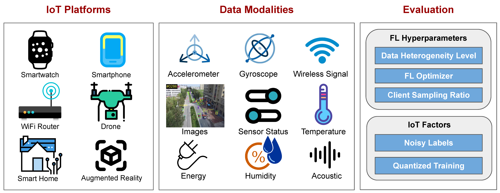
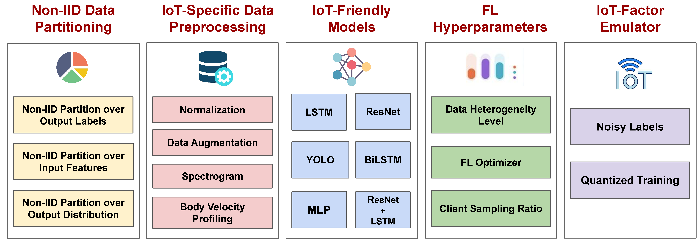
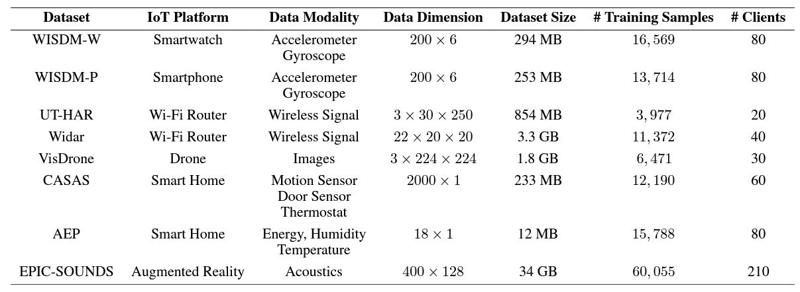

# FedAIoT: A Federated Learning Benchmark for Artificial Intelligence of Things

## Table of Contents
1. [Introduction](#introduction)
2. [Requirements](#requirements)
3. [Datasets](#datasets)
4. [Usage](#usage)

## Introduction
Despite the significant relevance of federated learning (FL) in the realm of IoT, most existing FL works are conducted on well-known datasets such as CIFAR-10 and CIFAR-100. These datasets, however, do not originate from authentic IoT devices and thus fail to capture the unique modalities and inherent challenges associated with real-world IoT data. This notable discrepancy underscores a strong need for an IoT-oriented FL benchmark to fill this critical gap.

This repository holds the source code for `FedAIoT: A Federated Learning Benchmark for Artificial Intelligence of Things`. FedAIot is a benchmarking tool for evaluating federated learning algorithms against real IoT datasets. FedAIoT contains eight well-chosen datasets collected from a wide range of authentic IoT devices from smartwatch, smartphone and Wi-Fi routers, to drones, smart home sensors, and head-mounted device that either have already become an indispensable part of people’s daily lives or are driving emerging applications. These datasets encapsulate a variety of unique IoT-specific data modalities such as wireless data, drone images, and smart home sensor data (e.g., motion, energy, humidity, temperature) that have not been explored in existing FL benchmarks. 

<p align="center">

</p>

To facilitate the community benchmark the performance of the datasets and ensure reproducibility, FedAIoT includes a unified end-to-end FL framework for AIoT, which covers the complete FLfor- AIoT pipeline: from non-independent and identically distributed (non-IID) data partitioning, IoT-specific data preprocessing, to IoT-friendly models, FL hyperparameters, and IoT-factor emulator. 

<p align="center">

</p>


## Requirements

```bash
pip install -r requirements.txt
```
## Datasets

FedAIoT currently includes the following eight IoT datasets:

<p align="center">

</p>

Each dataset folder contains the `download.py` script to download the dataset.


[//]: # (## Non-IID Partition Scheme)

[//]: # (The partition classes split a large dataset into a list of smaller datasets. Several Partition methods are implemented. )

[//]: # (1. Centralized essentially returns the original dataset as a list of one dataset.)

[//]: # (2. Dirichlet partitions the dataset into a specified number of clients with non-IID dirichlet distribution.)

[//]: # ()
[//]: # (Create a partition object and use that to prtition any centralized dataset. Using the same partition on two )

[//]: # (different data splits will result in the same distribution of data between clients. For example:)

[//]: # (```python)

[//]: # (    partition = DirichletPartition&#40;num_clients=10&#41;)

[//]: # (    train_partition = partition&#40;dataset['train']&#41;)

[//]: # (```)

[//]: # (Here `train_partition` and `test_partition` will have `10` clients with the same relative class and sample  )

[//]: # (distribution.)

[//]: # ()
[//]: # (For more details on implementation: [See here]&#40;https://github.com/AIoT-MLSys-Lab/FedAIoT/blob/61d8147d56f7ef4ea04d43a708f4de523f9e36bc/distributed_main.py#L129-L145&#41;)


[//]: # ([//]: # &#40;## Models&#41;)
[//]: # ()
[//]: # ([//]: # &#40;&#41;)
[//]: # ([//]: # &#40;The experiment supports various models and allows you to use custom models as well. See the models directory for the &#41;)
[//]: # ()
[//]: # ([//]: # &#40;individual implementations of the models for the respective datasets.&#41;)
[//]: # ()
[//]: # (## Training)

[//]: # ()
[//]: # (The experiment supports different federated learning algorithms and partition types. You can configure the experiment settings by modifying the `config.yml` file or passing the required parameters when running the script.)

[//]: # ()
[//]: # (The basic federated learning algorithm is implemented in the `algorithm.base_fl` module. Given an `aggregator` &#40;See )

[//]: # (aggregator module&#41;, `client_trainers` &#40;ray actors for distributed training&#41;, `client_dataset_refs` &#40;ray data )

[//]: # (references&#41;, `client_num_per_round` &#40;Number of clients sampled per round; < total clients&#41;, `global_model`, `round_idx`, )

[//]: # (`scheduler`, `device` &#40;cpu or gpu&#41;, it runs one round of federated learning following vanilla fed avg.)

[//]: # (The following federated learning algorithms are included in the benchmark:)

[//]: # ()
[//]: # (- FedAvg)

[//]: # (- FedAdam)

[//]: # ()
[//]: # ()
[//]: # (Various training options and hyperparameters can be configured, such as the optimizer, learning rate, weight decay, epochs, and more.)

## Usage
Before running, we need to set the environment variables `num_gpus` and `num_trainers_per_gpu`. This will set the total number of workers for the distributed system. If you want to use a subset of GPUs available in the hardware, specify the GPUs to be used by `CUDA_VISIBLE_DEVICES` variable.

Take WISDM-W as an example. To train a centralized model on WISDM-W:

```
num_gpus=1 num_trainers_per_gpu=1 CUDA_VISIBLE_DEVICES=0 python distributed_main.py main --dataset_name wisdm_watch --model LSTM_NET --client_num_in_total 1 --client_num_per_round 1 --partition_type central --alpha 0.1 --lr 0.01 --server_optimizer sgd --server_lr 1 --test_frequency 5 --comm_round 200 --batch_size 128 --analysis baseline --trainer BaseTrainer --watch_metric accuracy
```

To train a federated model on WISDM-W with FedAvg and `10%` client sampling rate under high data heterogeneity:

```
num_gpus=1 num_trainers_per_gpu=1 CUDA_VISIBLE_DEVICES=0 python distributed_main.py main --dataset_name wisdm_watch --model LSTM_NET --client_num_in_total 80 --client_num_per_round 8 --partition_type dirichlet --alpha 0.1 --lr 0.01 --server_optimizer sgd --server_lr 1 --test_frequency 5 --comm_round 400 --batch_size 32 --analysis baseline --trainer BaseTrainer --watch_metric accuracy
```

For the full list of parameters, run:
```
python distributed_main.py main --help
```
